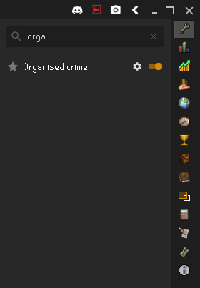
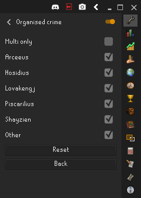
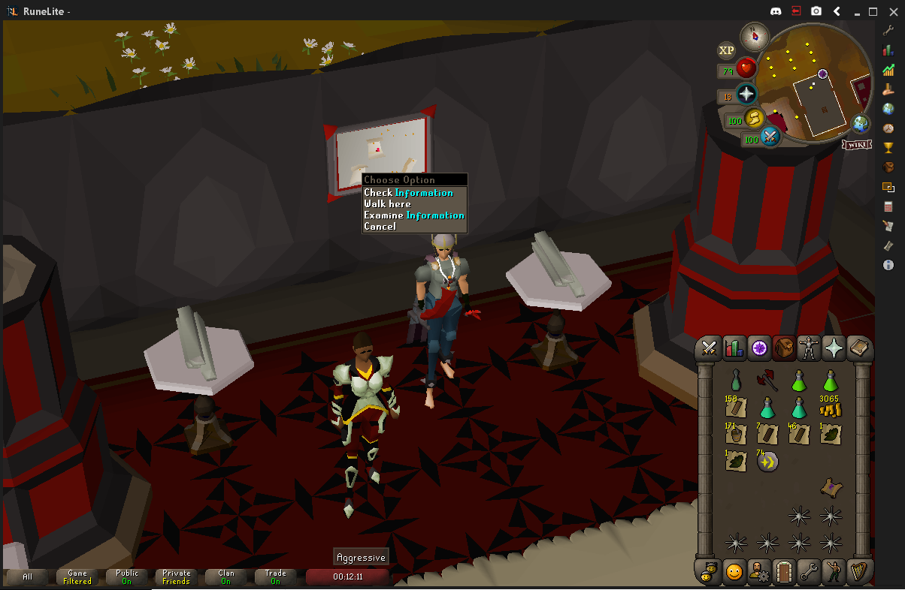
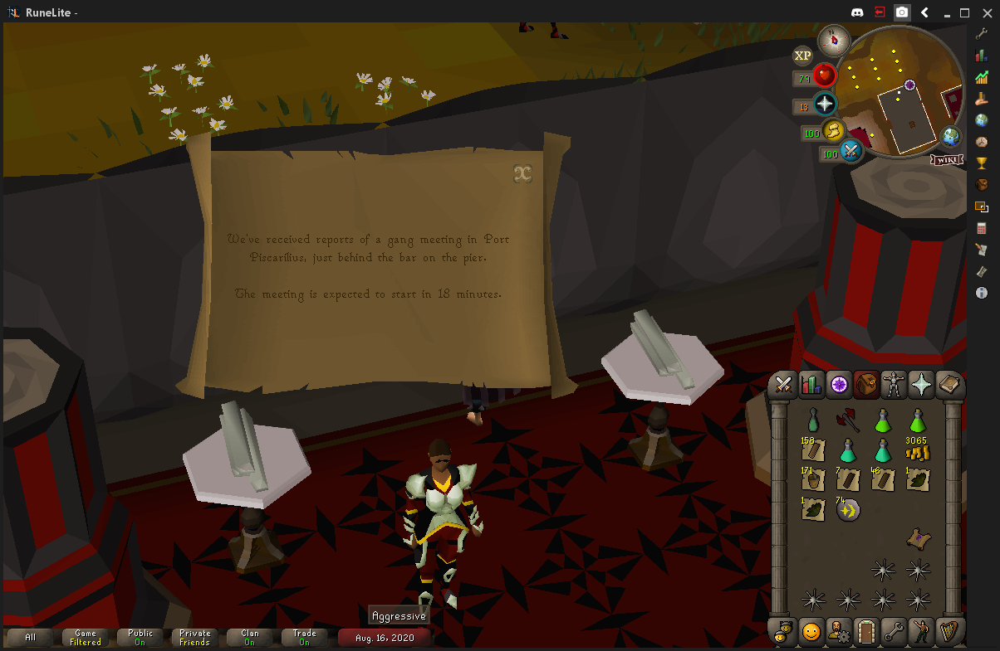
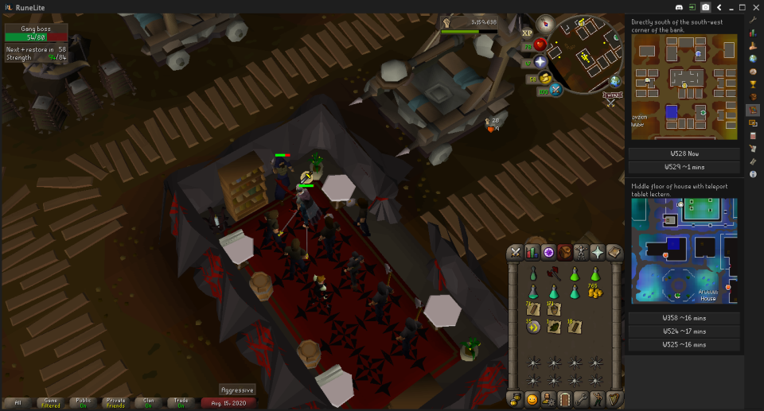

# Shayzien Organised Crime

As you hop worlds and read the information board by Captain Ginea, this plugin will keep track of the locations and estimated times for gangs appearing.

### Features

- Click on the buttons to quick-hop to the world.
- Shows the wiki images which indicate the location on the map.
- Automatically cull stale entries which are more than 5 minutes old

### How to use

#### Installing

Make sure you've installed this plugin from the RuneLite plugin hub, and enabled it in your client. See [here](https://github.com/runelite/runelite/wiki/Information-about-the-Plugin-Hub) for information on how to install plugins from the plugin hub.

After it's installed, you should be able to enable it by searching your plugins for "Organised crime".
After that, you can choose which locations the plugin keeps track of.

 

#### Using

Go to the information board by Captain Ginea | Read the board so the plugin can track it. Repeat this across as many worlds as you'd like
--- | ---
 | 
**Go to the shown locations, and click the buttons to hop to the world**  |
 |

### Contribute

Feel free to post issues to this GitHub project, or even open pull requests if you've got something you'd like to add/change.
